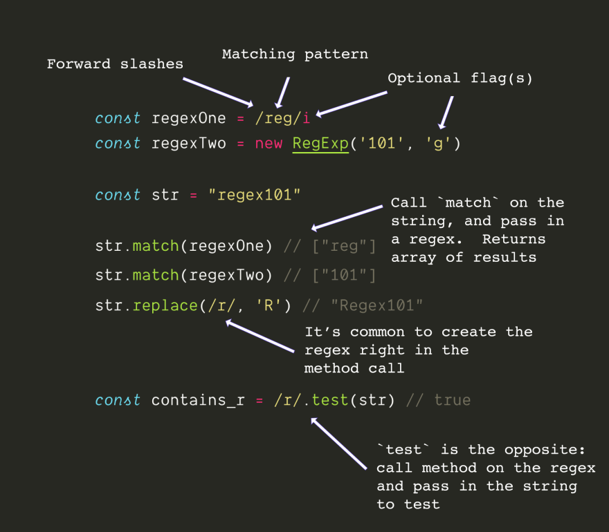

# REGEX in JS

`Regular Expression Signs`: **//** or **new RegExp()**
`Methods`: **match**, **test**, or **replace**

## 1


## 2


## 3
In Javascript, these flags are:
```
i = case insensitive
m = multi line matching
g = global match (find all, instead of find one)
```


## 4
```
caret sign ^ = start of string
dollar sign $ = end of string
```


## 5
```
. = any character except line break

\d = digit
\D = NOT a digit

\s = white space
\S = any NON white space

\n = new line

\w = short hand of [a-zA-Z0-9_]
\W = short hand of [^a-zA-Z0-9_]
```


## 6
```
* = zero or more
+ = one more more 
? = 0 or 1 
{3} = exactly 3 times 
{2, 4} = two, three, or four times 
{2,} = two or more times
```


## 7
```
Use parens () to capture in a group

match will return the full match plus the groups, unless you use the g flag

Use the pipe operator | inside of parens () to specify what that group matches

| = or
```

### Reuse Pattern
```
/(test)(\s)\1\2\1/ === /test\stest\stest/
```

### Use Capture Groups to Search and ReplacePassed

```
"Code Camp".replace(/(\w+)\s(\w+)/, '$2 $1') // Camp Code
```


## 8
```
To match special characters, escape them with a backslash \

Special characters in JS regex are: ^ $ \ . * + ? ( ) [ ] { } |

So to match an asterisks, you'd use: \* instead of just *
```


## 9
```
To match anything BUT a certain character, use a caret ^ inside of square brackets

This means ^ has two meanings, which can be confusing.

It means both "start of string" when it is at the front of a regex, and "not this character" when used inside of square brackets.
```


## 10
Regexs can be used to find and match all sort of things, from urls to filenames

HOWEVER! be careful if you try to use regexs for really complex tasks, such as parsing emails (which get really confusing, really fast), or HTML (which is not a regular language, and so can't be fully parsed by a regular expression)

There is (of course) much more to regex like lazy vs greedy, lookahead, and capturing

but most of what web developers want to do with regular expressions can use just these base building blocks.
