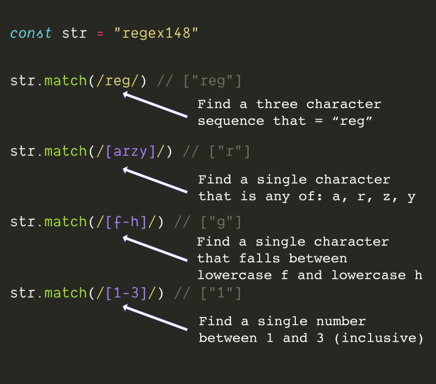

# REGEX in JS

- `Regular Expression Signs`: **//** or **new RegExp()**
- `Methods`: **match**, **test**, or **replace**

**Most used expressions:**

| Expression |                      Description                      |
| :--------: | ----------------------------------------------------- |
|     .      |                 Matches any character                 |
|     \*     |  Means any number of times—cannot be used on its own  |
|     ?      |      Zero or one time—cannot be used on its own       |
|     +      |   Means one or more times—cannot be used on its own   |
|     ^      |        This denotes the beginning of the line         |
|     $      |           This denotes the end of the line            |
|     []     |             [] is for grouping characters             |
|   [A-Z]    | This means all characters from capital A to capital Z |
|     \d     |                   Any digit in 0-9                    |
|     \D     |                      A non-digit                      |
|     \w     |           Any word character: [0-9A-Za-z_]            |
|     \W     |                Any non-word character                 |
|     \s     |                A whitespace character                 |
|     \S     |              A non-whitespace character               |

## 1


## 2


## 3
In Javascript, these flags are:
```
i = case insensitive
m = multi line matching
g = global match (find all, instead of find one)
```


## 4
```
caret sign ^ = start of string
dollar sign $ = end of string
```


## 5
```
. = any character except line break

\d = digit
\D = NOT a digit

\s = white space
\S = any NON white space

\n = new line

\w = short hand of [a-zA-Z0-9_]
\W = short hand of [^a-zA-Z0-9_]
```


## 6
```
* = zero or more
+ = one more more 
? = 0 or 1 
{3} = exactly 3 times 
{2, 4} = two, three, or four times 
{2,} = two or more times
```


### 7 Lazy matching

- a greedy match finds the longest possible part of a string that fits the regex pattern
- a lazy match, which finds the smallest possible part of the string that satisfies the regex pattern

```
"<h1>Winter is coming</h1>".match(/<.*>/) // <h1>Winter is coming</h1>
"<h1>Winter is coming</h1>".match(/<.*?>/) // <h1>
```

## 8
```
Use parens () to capture in a group

match will return the full match plus the groups, unless you use the g flag

Use the pipe operator | inside of parens () to specify what that group matches

| = or
```

### Reuse Pattern
```
/(test)(\s)\1\2\1/ === /test\stest\stest/
```

### Use Capture Groups to Search and ReplacePassed

```
"Code Camp".replace(/(\w+)\s(\w+)/, '$2 $1') // Camp Code
```


## 9
```
To match special characters, escape them with a backslash \

Special characters in JS regex are: ^ $ \ . * + ? ( ) [ ] { } |

So to match an asterisks, you'd use: \* instead of just *
```


## 10
```
To match anything BUT a certain character, use a caret ^ inside of square brackets

This means ^ has two meanings, which can be confusing.

It means both "start of string" when it is at the front of a regex, and "not this character" when used inside of square brackets.
```


## 11 Lookahead and Lookbehind

```
?:  is for non capturing group
?=  is for positive look ahead
?!  is for negative look ahead
?<= is for positive look behind
?<! is for negative look behind
```

The difference between ?= and ?! is that the former requires the given expression to match and the latter requires it to not match. For example a(?=b) will match the "a" in "ab", but not the "a" in "ac". Whereas a(?!b) will match the "a" in "ac", but not the "a" in "ab".

The difference between ?: and ?= is that ?= excludes the expression from the entire match while ?: just doesn't create a capturing group. So for example a(?:b) will match the "ab" in "abc", while a(?=b) will only match the "a" in "abc". a(b) would match the "ab" in "abc" and create a capture containing the "b".

**Link**: [Lookahead and Lookbehind Zero-Length Assertions](http://www.regular-expressions.info/lookaround.html)

## 12
Regexs can be used to find and match all sort of things, from urls to filenames

HOWEVER! be careful if you try to use regexs for really complex tasks, such as parsing emails (which get really confusing, really fast), or HTML (which is not a regular language, and so can't be fully parsed by a regular expression)

There is (of course) much more to regex like lazy vs greedy, lookahead, and capturing

but most of what web developers want to do with regular expressions can use just these base building blocks.

## 13. Variable in regex

```js
const fruits = ["apple", "pineapple", "banana", "grape"]
const q = "ap"
// contains "q" in a string
const pattern = new RegExp(`\.*${q}\.*`, "i");
fruits.filter(fruit => pattern.test(fruit)) // ["apple", "pineapple", "grape"]
```

### Examples

- **Email validation:**
```js
const pattern = /[a-z0-9!#$%&'*+/=?^_`{|}~-]+(?:\.[a-z0-9!#$%&'*+/=?^_`{|}~-]+)*@(?:[a-z0-9](?:[a-z0-9-]*[a-z0-9])?\.)+[a-z0-9](?:[a-z0-9-]*[a-z0-9])?/
const isValidEmail = pattern.test(str)
```

- **Password validation:**
```js
// At least 1 uppercase character.
// At least 1 lowercase character.
// At least 1 digit.
// At least 1 special character.
// Minimum 6 characters.

const pattern = /^(?=.*[a-z])(?=.*[A-Z])(?=.*\d)(?=.*(\W|_)).{6,}$/
const isValidPassword = pattern.test(str)
```

- **Phone validation:**
```js
const onlyNums = value.replace(/[^\d]/g, '')
if (onlyNums.length <= 3) {
 return onlyNums
}
if (onlyNums.length <= 7) {
 return `${onlyNums.slice(0, 3)}-${onlyNums.slice(3)}`
}
return `${onlyNums.slice(0, 3)}-${onlyNums.slice(3, 6)}-${onlyNums.slice(
 6,
 10
)}`
```

- **Url validation:**
```js
const pattern = /[-a-zA-Z0-9@:%_\+.~#?&//=]{2,256}\.[a-z]{2,4}\b(\/[-a-zA-Z0-9@:%_\+.~#?&//=]*)?/gi
const isValidUrl = pattern.test(str)
```


**Links:**
- [Learn Regex](https://github.com/ziishaned/learn-regex)
- [Regex Cheat Sheet in Python](https://www.dataquest.io/blog/regex-cheatsheet/)
